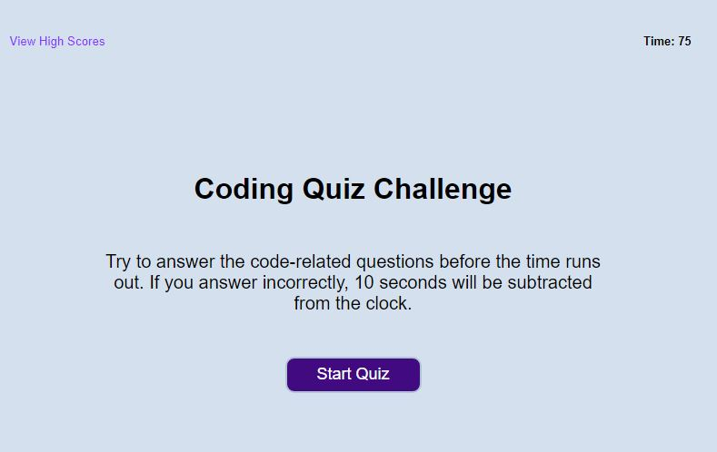

# Coding Fundamentals Quiz

## About the Quiz
*   When the start button is clicked, a timed coding quiz begins. 
*   If a question is answered incorrectly, time is subtracted from the clock.
*   The quiz is over when all the questions are answered, or the timer runs out.
*   You can save your initials and your score to track progress.

https://savbennett8.github.io/code-quiz/

